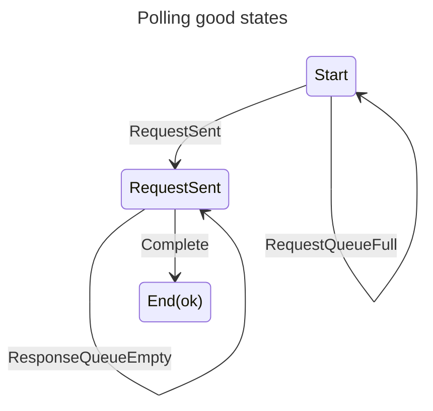
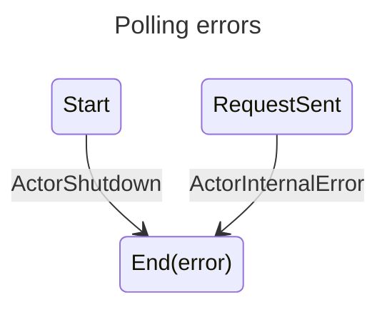

# actor-rs

Simple Rust Actors

# API

## Block

> TODO,

## Poll

1. Load the data that you want to sent to the actor
2. Get a Promise back
3. Poll the Promise till data is received

```rust
let actor_ref = todo!("Get your actor ref");
let mut promise = actor_ref.as_poll(request);
loop {
  let _result = promise.poll_once();
  if promise.get().is_some() {
    // Data has been received
    break;
  }
}
let data: Option<&Response> = promise.get();
```

```rust
// Another way to do the same thing
let actor_ref = todo!("Get your actor ref");
let mut promise = actor_ref.as_poll(request);
loop {
  let result = promise.poll_once();
  if result.is_ok() {
    if matches!(res.unwrap(), ActorRefPollInfo::Complete) {
        break;
    }
  }
}
let data: Option<&Response> = promise.get();
```





## Notes

- `crossbeam-channel` has been used purely for its `select!` macro
  - If this lands in rust `std` consider removing dependency on this library
